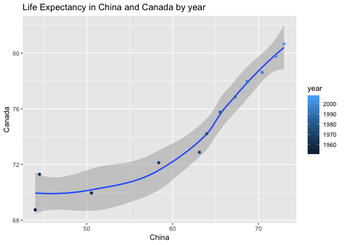
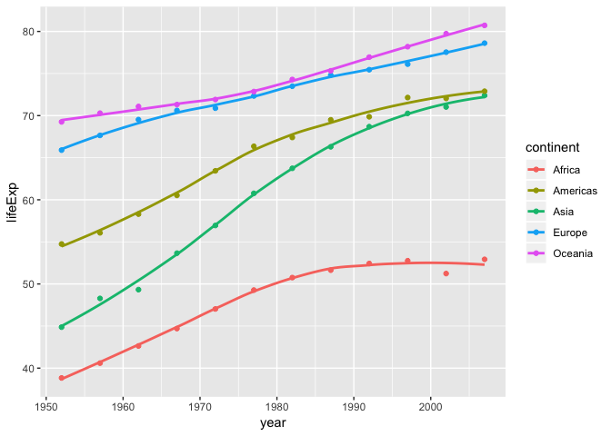

hw04:Tidy data and joins
================
Zuheng(David) Xu
2018-10-09

Introduction
============

The aim of this assignment is to practice and solidify my data wrangling skills, like data aggregation and data reshaping. I chose `gapminder` as the dataset to practice the data reshaping prompts and join prompts.

``` r
library(gapminder)
library(tidyverse)
library(ggplot2)
library(knitr)
```

Tasks
=====

1. Data Reshaping Prompts
-------------------------

### 1.1 Activity \#2

In this section, I will make a tibble with one row per year and columns for life expectancy for countriy `China`,`Canada`, `United Kingdom`, `United States`, and use `knitr::kable()` fucntion to represent my results. Also, I will use scatterplot for visualization.

First of all, I need filter the four country out and using `spread` function to reshape the dataset.

``` r
#data set creating and reshape 
country_life = gapminder %>% 
  filter(country %in% c("China","Canada","United States","United Kingdom")) %>% 
  select(country, year, lifeExp) %>% # filter the data
  #reshape the data, putting country into 1 col
  spread(key = country, value = lifeExp) 
```

Then using `kable` to generate a readable table.

``` r
country_life %>% 
  knitr::kable(caption = "Life Expectancy for Each Year",
               col.names = c("Year", "Canada","China","UK","US"),
               format = "markdown",
               booktabs = TRUE,
               padding = 0)
```

|  Year|  Canada|     China|      UK|      US|
|-----:|-------:|---------:|-------:|-------:|
|  1952|  68.750|  44.00000|  69.180|  68.440|
|  1957|  69.960|  50.54896|  70.420|  69.490|
|  1962|  71.300|  44.50136|  70.760|  70.210|
|  1967|  72.130|  58.38112|  71.360|  70.760|
|  1972|  72.880|  63.11888|  72.010|  71.340|
|  1977|  74.210|  63.96736|  72.760|  73.380|
|  1982|  75.760|  65.52500|  74.040|  74.650|
|  1987|  76.860|  67.27400|  75.007|  75.020|
|  1992|  77.950|  68.69000|  76.420|  76.090|
|  1997|  78.610|  70.42600|  77.218|  76.810|
|  2002|  79.770|  72.02800|  78.471|  77.310|
|  2007|  80.653|  72.96100|  79.425|  78.242|

Now I will choose `Canada` and `China` to make a scatter plot aganst each other. The package I will use is `ggplot2`.

``` r
country_life %>% 
  ggplot(aes(China , Canada)) +
  geom_smooth() +
  geom_point(aes(color = year)) +
  theme_gray()+
  labs(title = "Life Expectancy in China and Canada by year")
```

    ## `geom_smooth()` using method = 'loess' and formula 'y ~ x'



Obviously, the life expectancy changing by year of China is not consistent with which of Canada. Generally, Canada has higher life expectancy which increase averagely during these years, while China shows faster increase in life expectancy during 1960 to 1980 and then shows almost the same pace of increase.

### 1.2 Activity \#3

In this section, I will use choose the median as the measure of life expectancy and group the data by continent and year.

``` r
#using summarise to calculate median in each continent each year
contyear_life_med = gapminder %>% 
  group_by(continent , year) %>% 
  summarise(Median_contyear = median(lifeExp)) %>% 
  #reshape into a dataframe has a var fro each continent 
  spread(key = continent, value = Median_contyear)

#generate table
contyear_life_med %>% 
  knitr::kable(caption = 
              "Median Life Expectancy for Each continent by year",
               format = "markdown",
               booktabs = TRUE,
               padding = 0)
```

|  year|   Africa|  Americas|    Asia|   Europe|  Oceania|
|-----:|--------:|---------:|-------:|--------:|--------:|
|  1952|  38.8330|    54.745|  44.869|  65.9000|  69.2550|
|  1957|  40.5925|    56.074|  48.284|  67.6500|  70.2950|
|  1962|  42.6305|    58.299|  49.325|  69.5250|  71.0850|
|  1967|  44.6985|    60.523|  53.655|  70.6100|  71.3100|
|  1972|  47.0315|    63.441|  56.950|  70.8850|  71.9100|
|  1977|  49.2725|    66.353|  60.765|  72.3350|  72.8550|
|  1982|  50.7560|    67.405|  63.739|  73.4900|  74.2900|
|  1987|  51.6395|    69.498|  66.295|  74.8150|  75.3200|
|  1992|  52.4290|    69.862|  68.690|  75.4510|  76.9450|
|  1997|  52.7590|    72.146|  70.265|  76.1160|  78.1900|
|  2002|  51.2355|    72.047|  71.028|  77.5365|  79.7400|
|  2007|  52.9265|    72.899|  72.396|  78.6085|  80.7195|

To make plot by continent easier, it's better to filp the table by put continent as the first col name and each col for a year.

``` r
# to put the year in cols
yearcont_life_med = gapminder %>% 
  group_by(continent , year) %>% 
  summarise(Median_contyear = median(lifeExp)) %>% 
  #reshape into a dataframe has vars of each year  
  spread(key = year, value = Median_contyear) 
  #generate table
yearcont_life_med %>% 
  knitr::kable(caption = 
              "Median Life Expectancy for Each continent by year",
               format = "markdown",
               booktabs = TRUE,
               padding = 0)
```

<table style="width:100%;">
<colgroup>
<col width="9%" />
<col width="6%" />
<col width="7%" />
<col width="7%" />
<col width="7%" />
<col width="7%" />
<col width="7%" />
<col width="6%" />
<col width="7%" />
<col width="6%" />
<col width="6%" />
<col width="7%" />
<col width="7%" />
</colgroup>
<thead>
<tr class="header">
<th align="left">continent</th>
<th align="right">1952</th>
<th align="right">1957</th>
<th align="right">1962</th>
<th align="right">1967</th>
<th align="right">1972</th>
<th align="right">1977</th>
<th align="right">1982</th>
<th align="right">1987</th>
<th align="right">1992</th>
<th align="right">1997</th>
<th align="right">2002</th>
<th align="right">2007</th>
</tr>
</thead>
<tbody>
<tr class="odd">
<td align="left">Africa</td>
<td align="right">38.833</td>
<td align="right">40.5925</td>
<td align="right">42.6305</td>
<td align="right">44.6985</td>
<td align="right">47.0315</td>
<td align="right">49.2725</td>
<td align="right">50.756</td>
<td align="right">51.6395</td>
<td align="right">52.429</td>
<td align="right">52.759</td>
<td align="right">51.2355</td>
<td align="right">52.9265</td>
</tr>
<tr class="even">
<td align="left">Americas</td>
<td align="right">54.745</td>
<td align="right">56.0740</td>
<td align="right">58.2990</td>
<td align="right">60.5230</td>
<td align="right">63.4410</td>
<td align="right">66.3530</td>
<td align="right">67.405</td>
<td align="right">69.4980</td>
<td align="right">69.862</td>
<td align="right">72.146</td>
<td align="right">72.0470</td>
<td align="right">72.8990</td>
</tr>
<tr class="odd">
<td align="left">Asia</td>
<td align="right">44.869</td>
<td align="right">48.2840</td>
<td align="right">49.3250</td>
<td align="right">53.6550</td>
<td align="right">56.9500</td>
<td align="right">60.7650</td>
<td align="right">63.739</td>
<td align="right">66.2950</td>
<td align="right">68.690</td>
<td align="right">70.265</td>
<td align="right">71.0280</td>
<td align="right">72.3960</td>
</tr>
<tr class="even">
<td align="left">Europe</td>
<td align="right">65.900</td>
<td align="right">67.6500</td>
<td align="right">69.5250</td>
<td align="right">70.6100</td>
<td align="right">70.8850</td>
<td align="right">72.3350</td>
<td align="right">73.490</td>
<td align="right">74.8150</td>
<td align="right">75.451</td>
<td align="right">76.116</td>
<td align="right">77.5365</td>
<td align="right">78.6085</td>
</tr>
<tr class="odd">
<td align="left">Oceania</td>
<td align="right">69.255</td>
<td align="right">70.2950</td>
<td align="right">71.0850</td>
<td align="right">71.3100</td>
<td align="right">71.9100</td>
<td align="right">72.8550</td>
<td align="right">74.290</td>
<td align="right">75.3200</td>
<td align="right">76.945</td>
<td align="right">78.190</td>
<td align="right">79.7400</td>
<td align="right">80.7195</td>
</tr>
</tbody>
</table>

However, both the two tidy data above is not suitable for giving a plot containing all information of year and country. If we want to do so, it's better to gather the data back.

``` r
# gathering data by continent
contyear_life_med %>% 
  gather(key = "continent", value = "lifeExp",   Africa,Asia,Americas,Europe,Oceania) %>% 
  #scatter and line plot
    ggplot(aes(year,lifeExp,color= continent)) +
  geom_smooth(se =FALSE,size=1)+
  geom_point()+
  theme_gray()
```

    ## `geom_smooth()` using method = 'loess' and formula 'y ~ x'



2. Join Prompts(Activity \#1)
-----------------------------

In this part, I will use the dataset built in package `wbstat`, which is a global socio-economic data, to explore the `join` funciton. The link of this data [is here](https://cran.r-project.org/web/packages/wbstats/vignettes/Using_the_wbstats_package.html)

To make things eaiser, I will only choose a part of the `gapminder`. I will fix the year in 2002, then select `country`,`continent`,`pop`,`gdpPercap` from `gapminder`.

``` r
gap = filter(gapminder, year == "2002") %>% 
  select(country, continent, pop, gdpPercap) %>% 
  drop_na()

# see the samples of this data
gap %>% head() %>% 
  knitr::kable(caption = "Samples of partial gapminder",
               format = "markdown",
               booktabs = TRUE,
               padding = 2)
```

| country     | continent |       pop|   gdpPercap|
|:------------|:----------|---------:|-----------:|
| Afghanistan | Asia      |  25268405|    726.7341|
| Albania     | Europe    |   3508512|   4604.2117|
| Algeria     | Africa    |  31287142|   5288.0404|
| Angola      | Africa    |  10866106|   2773.2873|
| Argentina   | Americas  |  38331121|   8797.6407|
| Australia   | Oceania   |  19546792|  30687.7547|

### 2.1 Creating complementary data

``` r
library(wbstats)
#finding available data with wb_cachelist
str(wb_cachelist$countries,max.level = 1)
```

    ## 'data.frame':    304 obs. of  18 variables:
    ##  $ iso3c        : chr  "ABW" "AFG" "AFR" "AGO" ...
    ##  $ iso2c        : chr  "AW" "AF" "A9" "AO" ...
    ##  $ country      : chr  "Aruba" "Afghanistan" "Africa" "Angola" ...
    ##  $ capital      : chr  "Oranjestad" "Kabul" NA "Luanda" ...
    ##  $ long         : chr  "-70.0167" "69.1761" NA "13.242" ...
    ##  $ lat          : chr  "12.5167" "34.5228" NA "-8.81155" ...
    ##  $ regionID     : chr  "LCN" "SAS" NA "SSF" ...
    ##  $ region_iso2c : chr  "ZJ" "8S" NA "ZG" ...
    ##  $ region       : chr  "Latin America & Caribbean " "South Asia" "Aggregates" "Sub-Saharan Africa " ...
    ##  $ adminID      : chr  NA "SAS" NA "SSA" ...
    ##  $ admin_iso2c  : chr  NA "8S" NA "ZF" ...
    ##  $ admin        : chr  NA "South Asia" NA "Sub-Saharan Africa (excluding high income)" ...
    ##  $ incomeID     : chr  "HIC" "LIC" NA "LMC" ...
    ##  $ income_iso2c : chr  "XD" "XM" NA "XN" ...
    ##  $ income       : chr  "High income" "Low income" "Aggregates" "Lower middle income" ...
    ##  $ lendingID    : chr  "LNX" "IDX" NA "IBD" ...
    ##  $ lending_iso2c: chr  "XX" "XI" NA "XF" ...
    ##  $ lending      : chr  "Not classified" "IDA" "Aggregates" "IBRD" ...

``` r
#creating new dataset
new_data = wb_cachelist$countries %>% 
  select(country,income,region) %>% 
  drop_na()#drop all the NA

#to see some samples in table
head(new_data) %>% 
  knitr::kable(caption = 
              "Samples of compelementary data",
               format = "markdown",
               booktabs = TRUE,
               padding = 0)
```

| country     | income              | region                    |
|:------------|:--------------------|:--------------------------|
| Aruba       | High income         | Latin America & Caribbean |
| Afghanistan | Low income          | South Asia                |
| Africa      | Aggregates          | Aggregates                |
| Angola      | Lower middle income | Sub-Saharan Africa        |
| Albania     | Upper middle income | Europe & Central Asia     |
| Andorra     | High income         | Europe & Central Asia     |

Before exploring the `join` funciton, I am going to see the overlaps of `country` between `gap` and `new_data`.

``` r
# to see how many overlaps of country 
gap$country %in% new_data$country %>% 
  sum()
```

    ## [1] 133

As shown in the output, there are 133 countries being in both 2 datasets, which may suffice to finish the task.

### 2.2 `full_join`

Let's try `full_join` here.

``` r
# full_join
f_join = full_join(gap, new_data, by = "country")
```

    ## Warning: Column `country` joining factor and character vector, coercing
    ## into character vector

``` r
# To see samples after full_join
head(f_join,10) %>% 
   knitr::kable(format = "markdown",
               booktabs = TRUE,
               padding = 0)
```

<table>
<colgroup>
<col width="13%" />
<col width="11%" />
<col width="11%" />
<col width="12%" />
<col width="22%" />
<col width="30%" />
</colgroup>
<thead>
<tr class="header">
<th align="left">country</th>
<th align="left">continent</th>
<th align="right">pop</th>
<th align="right">gdpPercap</th>
<th align="left">income</th>
<th align="left">region</th>
</tr>
</thead>
<tbody>
<tr class="odd">
<td align="left">Afghanistan</td>
<td align="left">Asia</td>
<td align="right">25268405</td>
<td align="right">726.7341</td>
<td align="left">Low income</td>
<td align="left">South Asia</td>
</tr>
<tr class="even">
<td align="left">Albania</td>
<td align="left">Europe</td>
<td align="right">3508512</td>
<td align="right">4604.2117</td>
<td align="left">Upper middle income</td>
<td align="left">Europe &amp; Central Asia</td>
</tr>
<tr class="odd">
<td align="left">Algeria</td>
<td align="left">Africa</td>
<td align="right">31287142</td>
<td align="right">5288.0404</td>
<td align="left">Upper middle income</td>
<td align="left">Middle East &amp; North Africa</td>
</tr>
<tr class="even">
<td align="left">Angola</td>
<td align="left">Africa</td>
<td align="right">10866106</td>
<td align="right">2773.2873</td>
<td align="left">Lower middle income</td>
<td align="left">Sub-Saharan Africa</td>
</tr>
<tr class="odd">
<td align="left">Argentina</td>
<td align="left">Americas</td>
<td align="right">38331121</td>
<td align="right">8797.6407</td>
<td align="left">Upper middle income</td>
<td align="left">Latin America &amp; Caribbean</td>
</tr>
<tr class="even">
<td align="left">Australia</td>
<td align="left">Oceania</td>
<td align="right">19546792</td>
<td align="right">30687.7547</td>
<td align="left">High income</td>
<td align="left">East Asia &amp; Pacific</td>
</tr>
<tr class="odd">
<td align="left">Austria</td>
<td align="left">Europe</td>
<td align="right">8148312</td>
<td align="right">32417.6077</td>
<td align="left">High income</td>
<td align="left">Europe &amp; Central Asia</td>
</tr>
<tr class="even">
<td align="left">Bahrain</td>
<td align="left">Asia</td>
<td align="right">656397</td>
<td align="right">23403.5593</td>
<td align="left">High income</td>
<td align="left">Middle East &amp; North Africa</td>
</tr>
<tr class="odd">
<td align="left">Bangladesh</td>
<td align="left">Asia</td>
<td align="right">135656790</td>
<td align="right">1136.3904</td>
<td align="left">Lower middle income</td>
<td align="left">South Asia</td>
</tr>
<tr class="even">
<td align="left">Belgium</td>
<td align="left">Europe</td>
<td align="right">10311970</td>
<td align="right">30485.8838</td>
<td align="left">High income</td>
<td align="left">Europe &amp; Central Asia</td>
</tr>
</tbody>
</table>

I am going to check the dimension of `f_join` and compare to `gap` & `new_data`

``` r
# dimension of f_join
(dim_f = dim(f_join)) 
```

    ## [1] 313   6

``` r
# dim of gap
dim(gap)
```

    ## [1] 142   4

``` r
#dim of new_data
dim(new_data)
```

    ## [1] 304   3

``` r
# to see how many overlaps of country 
gap$country %in% new_data$country %>% 
  sum()
```

    ## [1] 133

We can see that `full_join` keeps both 2 dataset and merge them together, while `left_join` and `right_join` only keep single side untouched and merge another to it, as we can see soon.

### 2.3 `left_join` and `right_join`

``` r
#left_join
l_join = left_join(gap, new_data, by = "country")
```

    ## Warning: Column `country` joining factor and character vector, coercing
    ## into character vector

``` r
#generate tables
head(l_join,10) %>% 
   knitr::kable(format = "markdown",
               booktabs = TRUE,
               padding = 0)
```

<table>
<colgroup>
<col width="13%" />
<col width="11%" />
<col width="11%" />
<col width="12%" />
<col width="22%" />
<col width="30%" />
</colgroup>
<thead>
<tr class="header">
<th align="left">country</th>
<th align="left">continent</th>
<th align="right">pop</th>
<th align="right">gdpPercap</th>
<th align="left">income</th>
<th align="left">region</th>
</tr>
</thead>
<tbody>
<tr class="odd">
<td align="left">Afghanistan</td>
<td align="left">Asia</td>
<td align="right">25268405</td>
<td align="right">726.7341</td>
<td align="left">Low income</td>
<td align="left">South Asia</td>
</tr>
<tr class="even">
<td align="left">Albania</td>
<td align="left">Europe</td>
<td align="right">3508512</td>
<td align="right">4604.2117</td>
<td align="left">Upper middle income</td>
<td align="left">Europe &amp; Central Asia</td>
</tr>
<tr class="odd">
<td align="left">Algeria</td>
<td align="left">Africa</td>
<td align="right">31287142</td>
<td align="right">5288.0404</td>
<td align="left">Upper middle income</td>
<td align="left">Middle East &amp; North Africa</td>
</tr>
<tr class="even">
<td align="left">Angola</td>
<td align="left">Africa</td>
<td align="right">10866106</td>
<td align="right">2773.2873</td>
<td align="left">Lower middle income</td>
<td align="left">Sub-Saharan Africa</td>
</tr>
<tr class="odd">
<td align="left">Argentina</td>
<td align="left">Americas</td>
<td align="right">38331121</td>
<td align="right">8797.6407</td>
<td align="left">Upper middle income</td>
<td align="left">Latin America &amp; Caribbean</td>
</tr>
<tr class="even">
<td align="left">Australia</td>
<td align="left">Oceania</td>
<td align="right">19546792</td>
<td align="right">30687.7547</td>
<td align="left">High income</td>
<td align="left">East Asia &amp; Pacific</td>
</tr>
<tr class="odd">
<td align="left">Austria</td>
<td align="left">Europe</td>
<td align="right">8148312</td>
<td align="right">32417.6077</td>
<td align="left">High income</td>
<td align="left">Europe &amp; Central Asia</td>
</tr>
<tr class="even">
<td align="left">Bahrain</td>
<td align="left">Asia</td>
<td align="right">656397</td>
<td align="right">23403.5593</td>
<td align="left">High income</td>
<td align="left">Middle East &amp; North Africa</td>
</tr>
<tr class="odd">
<td align="left">Bangladesh</td>
<td align="left">Asia</td>
<td align="right">135656790</td>
<td align="right">1136.3904</td>
<td align="left">Lower middle income</td>
<td align="left">South Asia</td>
</tr>
<tr class="even">
<td align="left">Belgium</td>
<td align="left">Europe</td>
<td align="right">10311970</td>
<td align="right">30485.8838</td>
<td align="left">High income</td>
<td align="left">Europe &amp; Central Asia</td>
</tr>
</tbody>
</table>

``` r
#right_join
r_join = right_join(gap, new_data, by = "country")
```

    ## Warning: Column `country` joining factor and character vector, coercing
    ## into character vector

``` r
#generate tables
head(r_join,10) %>% 
   knitr::kable(format = "markdown",
               booktabs = TRUE,
               padding = 0)
```

<table style="width:100%;">
<colgroup>
<col width="21%" />
<col width="10%" />
<col width="9%" />
<col width="10%" />
<col width="20%" />
<col width="27%" />
</colgroup>
<thead>
<tr class="header">
<th align="left">country</th>
<th align="left">continent</th>
<th align="right">pop</th>
<th align="right">gdpPercap</th>
<th align="left">income</th>
<th align="left">region</th>
</tr>
</thead>
<tbody>
<tr class="odd">
<td align="left">Aruba</td>
<td align="left">NA</td>
<td align="right">NA</td>
<td align="right">NA</td>
<td align="left">High income</td>
<td align="left">Latin America &amp; Caribbean</td>
</tr>
<tr class="even">
<td align="left">Afghanistan</td>
<td align="left">Asia</td>
<td align="right">25268405</td>
<td align="right">726.7341</td>
<td align="left">Low income</td>
<td align="left">South Asia</td>
</tr>
<tr class="odd">
<td align="left">Africa</td>
<td align="left">NA</td>
<td align="right">NA</td>
<td align="right">NA</td>
<td align="left">Aggregates</td>
<td align="left">Aggregates</td>
</tr>
<tr class="even">
<td align="left">Angola</td>
<td align="left">Africa</td>
<td align="right">10866106</td>
<td align="right">2773.2873</td>
<td align="left">Lower middle income</td>
<td align="left">Sub-Saharan Africa</td>
</tr>
<tr class="odd">
<td align="left">Albania</td>
<td align="left">Europe</td>
<td align="right">3508512</td>
<td align="right">4604.2117</td>
<td align="left">Upper middle income</td>
<td align="left">Europe &amp; Central Asia</td>
</tr>
<tr class="even">
<td align="left">Andorra</td>
<td align="left">NA</td>
<td align="right">NA</td>
<td align="right">NA</td>
<td align="left">High income</td>
<td align="left">Europe &amp; Central Asia</td>
</tr>
<tr class="odd">
<td align="left">Andean Region</td>
<td align="left">NA</td>
<td align="right">NA</td>
<td align="right">NA</td>
<td align="left">Aggregates</td>
<td align="left">Aggregates</td>
</tr>
<tr class="even">
<td align="left">Arab World</td>
<td align="left">NA</td>
<td align="right">NA</td>
<td align="right">NA</td>
<td align="left">Aggregates</td>
<td align="left">Aggregates</td>
</tr>
<tr class="odd">
<td align="left">United Arab Emirates</td>
<td align="left">NA</td>
<td align="right">NA</td>
<td align="right">NA</td>
<td align="left">High income</td>
<td align="left">Middle East &amp; North Africa</td>
</tr>
<tr class="even">
<td align="left">Argentina</td>
<td align="left">Americas</td>
<td align="right">38331121</td>
<td align="right">8797.6407</td>
<td align="left">Upper middle income</td>
<td align="left">Latin America &amp; Caribbean</td>
</tr>
</tbody>
</table>

Notice, if we change the order of those two dataset when conducting single sided join, will make `left_join` to `right_join` and vise versa.

### 2.4 `inner_join`

While former two types of `join` makes one table merges into another, `inner_join` only keeps the same observations, which sounds like finding intersects and will not generate "NA" entries.

``` r
#inner_join
in_join = inner_join(gap, new_data, by = "country")
```

    ## Warning: Column `country` joining factor and character vector, coercing
    ## into character vector

``` r
#generate table
head(in_join,10) %>% 
   knitr::kable(format = "markdown",
               booktabs = TRUE,
               padding = 0)
```

<table>
<colgroup>
<col width="13%" />
<col width="11%" />
<col width="11%" />
<col width="12%" />
<col width="22%" />
<col width="30%" />
</colgroup>
<thead>
<tr class="header">
<th align="left">country</th>
<th align="left">continent</th>
<th align="right">pop</th>
<th align="right">gdpPercap</th>
<th align="left">income</th>
<th align="left">region</th>
</tr>
</thead>
<tbody>
<tr class="odd">
<td align="left">Afghanistan</td>
<td align="left">Asia</td>
<td align="right">25268405</td>
<td align="right">726.7341</td>
<td align="left">Low income</td>
<td align="left">South Asia</td>
</tr>
<tr class="even">
<td align="left">Albania</td>
<td align="left">Europe</td>
<td align="right">3508512</td>
<td align="right">4604.2117</td>
<td align="left">Upper middle income</td>
<td align="left">Europe &amp; Central Asia</td>
</tr>
<tr class="odd">
<td align="left">Algeria</td>
<td align="left">Africa</td>
<td align="right">31287142</td>
<td align="right">5288.0404</td>
<td align="left">Upper middle income</td>
<td align="left">Middle East &amp; North Africa</td>
</tr>
<tr class="even">
<td align="left">Angola</td>
<td align="left">Africa</td>
<td align="right">10866106</td>
<td align="right">2773.2873</td>
<td align="left">Lower middle income</td>
<td align="left">Sub-Saharan Africa</td>
</tr>
<tr class="odd">
<td align="left">Argentina</td>
<td align="left">Americas</td>
<td align="right">38331121</td>
<td align="right">8797.6407</td>
<td align="left">Upper middle income</td>
<td align="left">Latin America &amp; Caribbean</td>
</tr>
<tr class="even">
<td align="left">Australia</td>
<td align="left">Oceania</td>
<td align="right">19546792</td>
<td align="right">30687.7547</td>
<td align="left">High income</td>
<td align="left">East Asia &amp; Pacific</td>
</tr>
<tr class="odd">
<td align="left">Austria</td>
<td align="left">Europe</td>
<td align="right">8148312</td>
<td align="right">32417.6077</td>
<td align="left">High income</td>
<td align="left">Europe &amp; Central Asia</td>
</tr>
<tr class="even">
<td align="left">Bahrain</td>
<td align="left">Asia</td>
<td align="right">656397</td>
<td align="right">23403.5593</td>
<td align="left">High income</td>
<td align="left">Middle East &amp; North Africa</td>
</tr>
<tr class="odd">
<td align="left">Bangladesh</td>
<td align="left">Asia</td>
<td align="right">135656790</td>
<td align="right">1136.3904</td>
<td align="left">Lower middle income</td>
<td align="left">South Asia</td>
</tr>
<tr class="even">
<td align="left">Belgium</td>
<td align="left">Europe</td>
<td align="right">10311970</td>
<td align="right">30485.8838</td>
<td align="left">High income</td>
<td align="left">Europe &amp; Central Asia</td>
</tr>
</tbody>
</table>

Here if we change the order of those two tables, the only difference is that the order of columns changes.

### 2.5 Filtering join

#### `semi_join`

``` r
#semi_join
s_join = semi_join(gap, new_data, by = "country")
```

    ## Warning: Column `country` joining factor and character vector, coercing
    ## into character vector

``` r
#generate table
head(s_join,10) %>% 
   knitr::kable(format = "markdown",
               booktabs = TRUE,
               padding = 0)
```

| country     | continent |        pop|   gdpPercap|
|:------------|:----------|----------:|-----------:|
| Afghanistan | Asia      |   25268405|    726.7341|
| Albania     | Europe    |    3508512|   4604.2117|
| Algeria     | Africa    |   31287142|   5288.0404|
| Angola      | Africa    |   10866106|   2773.2873|
| Argentina   | Americas  |   38331121|   8797.6407|
| Australia   | Oceania   |   19546792|  30687.7547|
| Austria     | Europe    |    8148312|  32417.6077|
| Bahrain     | Asia      |     656397|  23403.5593|
| Bangladesh  | Asia      |  135656790|   1136.3904|
| Belgium     | Europe    |   10311970|  30485.8838|

A `semi_join` differs from an `inner_join` because an inner join will return one row of x for each matching row of y, where a semi join will never duplicate rows of y. Therefore we can see that there are only 4 cols in the table.

#### `anti_join`

The `anti_join` only returns the elements that cannot be `semi_join`.

``` r
#anti_join
a_join = anti_join(gap, new_data, by = "country")
```

    ## Warning: Column `country` joining factor and character vector, coercing
    ## into character vector

``` r
#generate table
head(a_join,10) %>% 
   knitr::kable(format = "markdown",
               booktabs = TRUE,
               padding = 0)
```

| country          | continent |       pop|   gdpPercap|
|:-----------------|:----------|---------:|-----------:|
| Egypt            | Africa    |  73312559|   4754.6044|
| Gambia           | Africa    |   1457766|    660.5856|
| Hong Kong, China | Asia      |   6762476|  30209.0152|
| Iran             | Asia      |  66907826|   9240.7620|
| Korea, Dem. Rep. | Asia      |  22215365|   1646.7582|
| Reunion          | Africa    |    743981|   6316.1652|
| Syria            | Asia      |  17155814|   4090.9253|
| Taiwan           | Asia      |  22454239|  23235.4233|
| Venezuela        | Americas  |  24287670|   8605.0478|

### Dimension comparison

In this section, I will put the dimension of all those joins results into a table, which makes the property of each join more readable.

``` r
# dim of gap
dim_gap = dim(gap)
#dim of new_data
dim_data = dim(new_data)
# dimension of f_join
dim_f = dim(f_join) 
#dim of l_join
dim_l = dim(l_join)
#dim of r_join
dim_r = dim(r_join)
#dim of in_join
dim_in = dim(in_join)
#dim of semi_join
dim_s = dim(s_join)
#dim of l_join
dim_a = dim(a_join)
# put them in a table
data.frame(dim_gap,dim_data,dim_f,dim_l,dim_r,dim_in,dim_s,dim_a) %>% 
  knitr::kable(col.names = c("x","y","full","left","right","inner","semi","anti"),
    caption = "Dimension caparison",
    add.row.names = c("data","nrows","ncols"),
               format = "markdown")
```

|    x|    y|  full|  left|  right|  inner|  semi|  anti|
|----:|----:|-----:|-----:|------:|------:|-----:|-----:|
|  142|  304|   313|   142|    304|    133|   133|     9|
|    4|    3|     6|     6|      6|      6|     4|     4|

Referecnces
===========

1.  [complementary data in `wbstats`](https://cran.r-project.org/web/packages/wbstats/vignettes/Using_the_wbstats_package.html)

2.  [Table settings](https://rmarkdown.rstudio.com/lesson-7.html)
